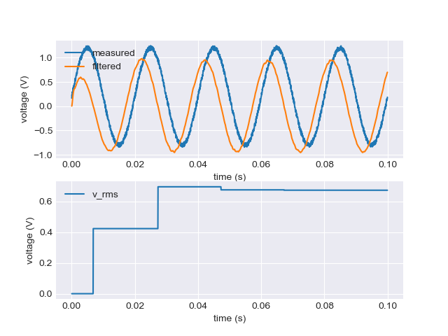

## Butterworth filter examples

Design parameters chosen:
- `fs` = 20kHz
- `f_c_hpf` = 30Hz
- `f_c_lpf` = 1kHz

The input (test) signal in blue is simulated to be a 50 Hz signal with an amplitude of 1 and a DC gain of 20%. A uniform random noise is augmented on this signal to emulate measurement noise. The output (yellow) is the AC component of the wave, with noise suppressed.

It can be observed that the filtered waveform is leading as compared to the blue waveform, but that is indeed an expected anomaly due to phase leads offered by high-pass filters. A possible solution to remove such a phase lead could be to use a Kalman filter to identify the DC bias and waveform separately.

The RMS voltage is correctly estimated as 0.707 as expected.

`bw2_lpf_hpf.c` does the following:
- Removes DC components with a high-pass filter.
- Removes measurement noise with a low-pass filter.
- Estimates the RMS of the AC voltage measurement.

- Filters in use are second-order Butterworth filters. These filters are known for their better roll-off rates, attenuation & lesser phase distortion as compared to simple first-order filters. Refer: bw2_filt_run
- The RMS is calculated at the end of the upper trough with the formula . Refer: estimate_v_rms_run
- The other RMS estimation formula  (sqrt of squares of so many samples) could rather be computationally expensive (depending on the FPU in use), since it involves taking squares and roots at every measurement (20 kHz). 
- I went with the option of keeping the old measurements in case there are wildly incorrect readings reported intermittently. The premise being that since measurements are sampled at 20 kHz, missing a sample or two wouldn’t be a disaster. However, there definitely should debounced diagnosis on such measurements and such failures should be escalated out to the diagnostic state machine/system level. Refer: check_measure_run
